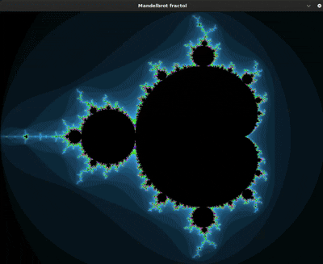

# Fract-ol

Questo progetto è un'esplorazione dei frattali di Mandelbrot e Julia, renderizzati utilizzando la libreria MiniLibX.



## Descrizione

`fract-ol` è un programma in C che visualizza diversi insiemi di frattali. Si puo' interagire con i frattali zoommando e spostandosi per esplorare i loro patterns.

## Frattali Implementati

-   **Mandelbrot**: Un frattale iconico generato iterando una semplice funzione su numeri complessi.
-   **Julia**: Una famiglia di frattali che utilizzano la stessa formula di Mandelbrot, ma con un parametro complesso costante.

## Controlli

-   **Rotellina del mouse**: Zoom avanti e indietro
-   **Tasti freccia**: Sposta la visuale
-   **ESC**: Esci dal programma

## Come Compilare ed Eseguire

1.  **Clona il repository:**
    ```bash
    git clone <URL_DEL_TUO_REPOSITORY>
    cd fract-ol
    ```

2.  **Compila il progetto:**
    ```bash
    make
    ```

3.  **Esegui il programma:**
    -   Per Mandelbrot:
        ```bash
        ./fractol Mandelbrot
        ```
    -   Per Julia (con parametri opzionali):
        ```bash
        ./fractol Julia [real_c] [imaginary_c]
        # Esempio:
        ./fractol Julia -0.7 0.27015
        ```

## Dipendenze

-   `MiniLibX`: Una libreria grafica per X-Window.
-   `libft`: Libreria di funzioni create in C

